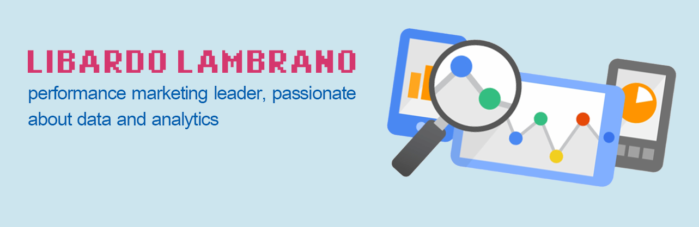

## Hi, I'm Libardo 👋

I'm a performance marketing leader who is passionate about data and analytics. I love research and data analysis. Nothing makes me happier than uncovering and sharing hidden insights behind the data. Some technologies I enjoy working with include Python for analytics (Pandas, Matplotlib, Seaborn), Tableau, MicroStrategy, Adobe Analytics, APIs, Markdown, SQL. Decisions that are not data-driven, make me turn red.

 

### Find me around the web: 
- Twitter <a href="https://twitter.com/llambrano"> www.twitter.com/llambrano</a>
- LinkedIn <a href="https://www.linkedin.com/in/libardo-lambrano/"> www.linkedin.com/in/libardo-lambrano/</a>
- Medium <a href="https://medium.com/@libardolambrano"> www.medium.com/@libardolambrano</a>

<!--
**llambrano/llambrano** is a ✨ _special_ ✨ repository because its `README.md` (this file) appears on your GitHub profile.

Here are some ideas to get you started:

- 🔭 I’m currently working on ...
- 🌱 I’m currently learning ...
- 👯 I’m looking to collaborate on ...
- 🤔 I’m looking for help with ...
- 💬 Ask me about ...
- 📫 How to reach me: ...
- 😄 Pronouns: ...
- ⚡ Fun fact: ...
-->
